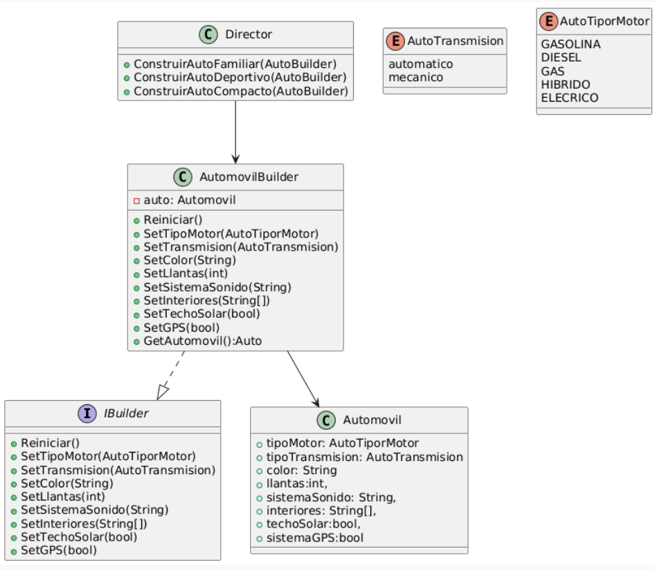
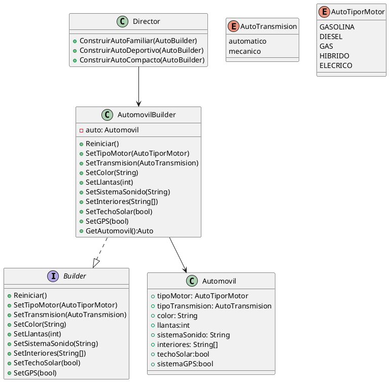
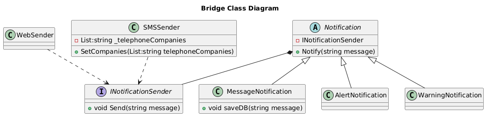

# Solución de Patrones de Diseño - Diplomado de Arquitectura de Software Universidad de la Sabana

---

## Grupo No. 5

## Problema 1: Personalización de Automóviles

### Escenario
Imagina que estás desarrollando una aplicación para una compañía automotriz que permite a los clientes personalizar y ordenar un automóvil. Un objeto Automóvil puede tener muchas configuraciones opcionales: tipo de motor, color, llantas, sistema de sonido, interiores, techo solar, navegación GPS, etc.

### Problema
Crear un objeto Automóvil con múltiples configuraciones puede llevar a constructores con muchos parámetros (el infame "constructor telescópico") o a múltiples constructores sobrecargados, lo que dificulta el mantenimiento y legibilidad del código.

### Beneficios esperados de la solución:
- Legibilidad y claridad: Facilitar la creación de objetos complejos con muchos parámetros sin necesidad de múltiples constructores o valores por defecto.  
- Inmutabilidad: Una vez creado el objeto, sus propiedades no se pueden modificar si el constructor lo define como inmutable.  
- Flexibilidad: Poder omitir atributos opcionales sin necesidad de crear subclases o múltiples constructores.  
- Separación de construcción y representación: Separar la lógica de construcción del objeto en sí, facilitando modificaciones futuras.

### Tipo de patrón
Creacional

### Patrón aplicado
Builder

### Diagrama de clases (PlantUML)


## Problema 2: Notificaciones Multiplataforma

### Escenario
Estás desarrollando una aplicación que gestiona la visualización de notificaciones en diferentes plataformas (por ejemplo: escritorio, móvil, web). Las notificaciones pueden ser de distintos tipos (mensaje, alerta, advertencia, confirmación) y cada tipo puede mostrarse de distintas formas según la plataforma.

### Problema
Si usas herencia tradicional, tendrías que crear clases como:  
- NotificacionMensajeWeb  
- NotificacionAlertaWeb  
- NotificacionMensajeMovil  
- NotificacionAlertaMovil  
Esto lleva rápidamente a una explosión combinatoria de subclases difíciles de mantener.

### Beneficios esperados de la solución:
- Separación de responsabilidades: Separar la lógica de la notificación del medio por el que se presenta.  
- Escalabilidad: Poder agregar nuevas plataformas o tipos de notificación sin modificar el resto del sistema.  
- Reducción de clases: Evitar la multiplicación de clases para cada combinación.  
- Flexibilidad en tiempo de ejecución: Poder cambiar la plataforma dinámicamente si es necesario.

### Tipo de patrón
Estructural

### Patrón aplicado
Bridge

### Diagrama de clases (PlantUML)


```plantuml
@startuml

interface IPlataforma{
 +EnviarMensaje(String)
}

class Notificacion {
-plataforma:IPlataforma,
+Alerta(String),
+Advertencia(String),
+Mensaje(String),
+Confirmacion(String)
}

class PlataformaEscritorio {
 +EnviarMensaje(String)
 }

class PlataformaMovil {
 +EnviarMensaje(String)
 }
 
 class PlataformaWeb {
  +EnviarMensaje(String)
 }
 
PlataformaEscritorio ..|> IPlataforma
PlataformaMovil --|>  IPlataforma
PlataformaWeb --|> IPlataforma
Notificacion *--> IPlataforma
@enduml


## Problema 3: Gestión de Mensajes en Chat Grupal

### Tipo de patrón
Pendiente de determinar

### Escenario
Estás desarrollando una aplicación de chat grupal. Los usuarios pueden enviarse mensajes entre sí dentro de una sala de chat. Sin embargo, gestionar las interacciones directas entre cada usuario haría que cada uno deba conocer y comunicarse con todos los demás, lo que resulta en una alta dependencia entre objetos.

### Problema
Sin un mediador, cada usuario tendría que mantener referencias directas a todos los demás, lo que genera un sistema difícil de escalar y mantener. Si agregas o eliminas usuarios, debes actualizar muchas relaciones.

### Beneficios esperados de la solución:
1. Facilita el mantenimiento: Agregar o eliminar usuarios no debe requerir modificar los demás.  
2. Mejor organización: La lógica de comunicación debe estar centralizada, no dispersa en muchos objetos.  
3. Reduce la complejidad: Evitar una red enmarañada de interacciones punto a punto.

---

### Solución
Pendiente de desarrollar.
